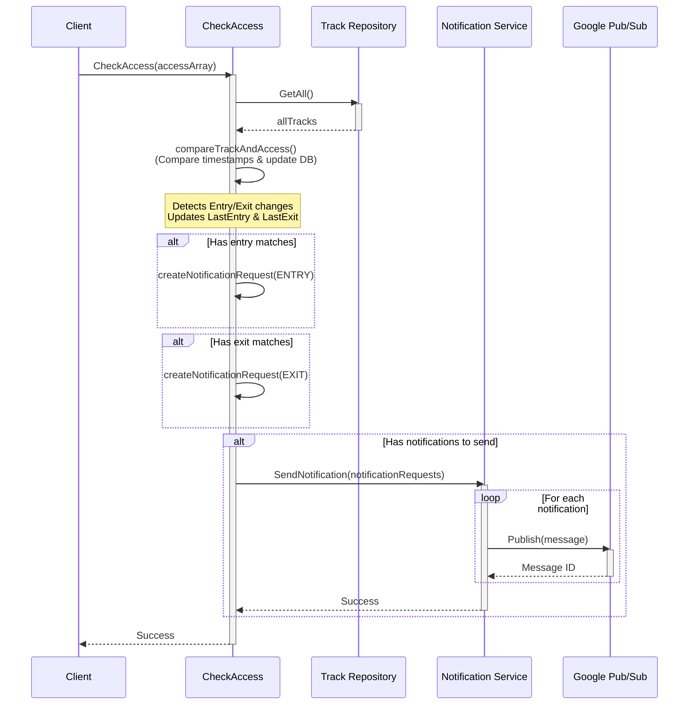

# SPL Notification Service

Notification service for the SPL system, implemented in Go with Google Cloud Pub/Sub integration.

## Features

- 📨 Notification delivery via Google Cloud Pub/Sub
- 🗄️ Turso database (libSQL)
- 📍 Location tracking

## Requirements

- Go 1.25.2 or higher
- Google Cloud Platform account with Pub/Sub enabled
- Turso database
- WhatsApp notification service

## Installation

1. Clone the repository:
```sh
git clone <repository-url>
cd spl-notification
```

2. Install dependencies:
```sh
go mod download
```

3. Configure environment variables:
```sh
cp .env.example .env
```

Edit the `.env` file with your credentials.

## Google Cloud Pub/Sub Configuration

1. Create a project in Google Cloud Platform
2. Enable the Pub/Sub API
3. Create a topic in Pub/Sub
4. Configure credentials (Application Default Credentials):
   ```sh
   gcloud auth application-default login
   ```
5. Add the environment variables:
   - `PUBSUB_PROJECT_ID`: Your GCP project ID
   - `PUBSUB_TOPIC_ID`: Pub/Sub topic ID

## Execution

### Development
```sh
make run
```

### Production
```sh
make build
./bin/spl-notification
```

## Project Structure

```
.
├── cmd/
│   └── spl-notification/     # Application entry point
├── internal/
│   ├── api/                  # HTTP controllers and middleware
│   ├── config/               # Application configuration
│   ├── database/             # Database connection
│   ├── dto/                  # Data transfer objects
│   ├── errors/               # Error handling
│   ├── model/                # Data models
│   ├── repository/           # Data access layer
│   ├── server/               # Server configuration
│   └── service/              # Business logic
└── migrations/               # Database migrations
```

## Notifications API

### Send Notifications

The `SendNotification` method publishes messages to Google Cloud Pub/Sub with the following structure:

**Payload:**
```json
{
  "type": 1,
  "date": "2025-10-12T16:00:00Z",
  "chatId": "123456789",
  "run": "12345678-9",
  "fullName": "Juan Pérez",
  "alias": "Juanito",
  "location": 1
}
```

**Message attributes:**
- `type`: Notification type (ENTRY/EXIT)
- `chatId`: WhatsApp chat ID
- `run`: User RUN (Chilean unique identifier)
- `location`: Location ID

## CheckAccess Method Flow

The `CheckAccess` method is responsible for comparing recent access records with tracked users and sending notifications when changes are detected.



### Flow Description

1. **Get Tracks**: Retrieves all tracked users from the database
2. **Compare**: For each access record, compares with tracked users by `ExternalID`
3. **Check Entry**: Compares `EntryAt` timestamp with `LastEntry` in track
   - If different or `LastEntry` is null, adds track to entry notifications
4. **Check Exit**: Compares `ExitAt` timestamp with `LastExit` in track
   - If different or values don't match, adds track to exit notifications
5. **Update DB**: Updates `LastEntry` and `LastExit` timestamps in database
6. **Build Notifications**: Creates notification requests with:
   - Type (ENTRY/EXIT)
   - Timestamp
   - User information (ChatID, Run, FullName, Alias)
   - Location
7. **Send to Pub/Sub**: Publishes all notifications to Google Cloud Pub/Sub queue

### Key Features

- ✅ Deduplication using maps to avoid duplicate notifications
- ✅ Atomic database updates via transactions
- ✅ Separate handling for entry and exit events
- ✅ Null-safe timestamp comparisons

## Tests

```sh
make test
```

